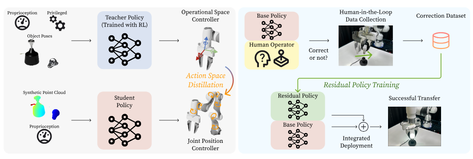

# Literature

## Papers on Policy Distillation

### <ins>Talked with Marius, suggested papers</ins>:

Policy Distillation for manipulation nowadays is most of the time done using vision-based student policies (pcl). RGB-based really rarely done. Proprioceptive-based?

### Reconciling Reality through Simulation: A Real-to-Sim-to-Real Approach for Robust Manipulation [[link]](https://arxiv.org/pdf/2107.04034)

- Novel policy distillation approach: Real world IL -> Sim world policy -> RL in SIM -> distillation to real again

### TRANSIC: Sim-to-Real Policy Transfer by Learning from Online Correction [[link]](https://arxiv.org/pdf/2405.10315)

### A System for General In-Hand Object Re-Orientation [[link]](https://arxiv.org/pdf/2107.04034)

### Learning Quadrupedal Locomotion over Challenging Terrain [[link]](https://arxiv.org/abs/2010.11251)

- One of the most influential Policy Distillation papers using privileged training architecture

### Look into Marco Hütters group for more papers..

### RMA: Rapid Motor Adaptation for Legged Robots [[link]](https://arxiv.org/pdf/2107.04034)

### <ins>Other interensting reads regarding policy distillation</ins>:

### Learning by cheating [[link]](https://arxiv.org/pdf/1912.12294)
- The original paper introducing this type of policy distillation known as LBC. Based on a teacher network trained with privileged information.

### UniGraspTransformer [[link]](https://arxiv.org/abs/2412.02699)

- Novel paper on Policy distillation for manipulation

### Continual Policy Distillation of Reinforcement Learning-based Controllers for Soft Robotic In-Hand Manipulation [[link]](https://arxiv.org/pdf/2404.04219)

- Leverages Policy Distillation, Continual Learning and Soft Robotics

### Learning by Watching: Physical Imitation of Manipulation Skills from Human Videos [[link]](https://arxiv.org/pdf/2101.07241)

## Papers on Robotic Manipulation in Cluttered Environments [[link]](https://robotic-manipulation.sciencehub.uw.edu/static/preprints/2023-grotz_rss.pdf)

### From Marius, highly confidential paper as still under submission [[link]](https://sites.google.com/view/swiperl-icra-2025?pli=1)
- leverages non-prehensile manipulation inside the Amazon shelf to make objects graspable 

### Towards robustly picking unseen objects from densely packed shelves [[link]](https://robotic-manipulation.sciencehub.uw.edu/static/preprints/2023-grotz_rss.pdf)

- Automating object picking in industrial warehouses, specifically for previously unseen objects in densely packed shelves (Also using Amazon shelf)

- System Components: Shelf inventory tracking, Object re-identification, Autonomous picking

### Efficient push-grasping for multiple target objects in clutter environments [[link]](https://www.frontiersin.org/journals/neurorobotics/articles/10.3389/fnbot.2023.1188468/full) 

- method proposes a "push-grasping" method that integrates pushing actions to create more space for grasping, thereby reducing the total number of actions required to complete the task.a

### Sim-Grasp: Learning 6-DOF Grasp Policies for Cluttered Environments Using a Synthetic Benchmark [[link]](https://arxiv.org/abs/2405.00841)
- point-net++ based framework for learning 6-degree-of-freedom grasp policies in highly cluttered environments. 

### Hierarchical Visual Policy Learning for Long-Horizon Robot Manipulation in Densely Cluttered Scenes [[link]](https://arxiv.org/abs/2312.02697)
-   authors propose a hierarchical visual policy learning approach to enable robots to perform long-horizon manipulation tasks in cluttered scenes; integrating visual perception and reinforcement learning

### Review of Learning-Based Robotic Manipulation in Cluttered Environments [[link]](https://www.mdpi.com/1424-8220/22/20/7938)
-   Review paper of late **August 2022** surveys of recent advancements in learning-based robotic manipulation for cluttered environments. Categorizes approaches into object removal, assembly, rearrangement, and retrieval.

### Technological development and optimization of pushing and grasping functions in robot arms: A review [[link]](https://www.sciencedirect.com/science/article/pii/S0263224124016142)
- **2024** Review paper of approaches that combine pushing and grasping, particularly to enable grasps of cluttered or stacked objects
### CEPB dataset: a photorealistic dataset to foster the research on bin picking in cluttered environments [[link]](https://www.frontiersin.org/journals/robotics-and-ai/articles/10.3389/frobt.2024.1222465/full)
-  Self explanatory dataset paper for cluttered environments

### TODO look more into non-prehensive manipulation to graspable pose literature 

## Papers on Force Proprioception-based Policies 

### FoAR: Force-Aware Reactive Policy for Contact-Rich Robotic Manipulation [[link]](https://arxiv.org/pdf/2411.15753l)

### Precise Object Placement Using Force-Torque Feedback [[link]](https://arxiv.org/pdf/2404.17668)

- 2024 workshop paper

### PROPRIOCEPTIVE LEARNING WITH SOFT POLYHEDRAL NETWORKS [[link]](https://arxiv.org/pdf/2308.08538)
- 2024, TODO

### Fingertip 6-Axis Force/Torque Sensing for Texture Recognition in Robotic Manipulation [[link]](https://ieeexplore.ieee.org/stamp/stamp.jsp?tp=&arnumber=9613688)
- 2021 paper, interesting if we want to discriminate books based on their texture?

### Reinforcement Learning on Variable Impedance Controller for High-Precision Robotic Assembly [[link]](https://arxiv.org/pdf/1903.01066)
- 2019 paper, introduced RL with Force Sensing

### Learning Force Control Policies for Compliant Manipulation [[link]](https://ieeexplore.ieee.org/stamp/stamp.jsp?tp=&arnumber=6095096)

- 2011 Schaal classical Paper on using Force Control for manipulation
