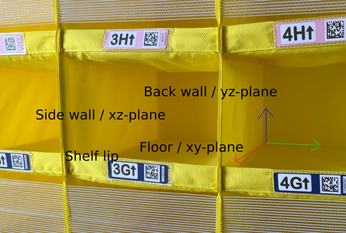
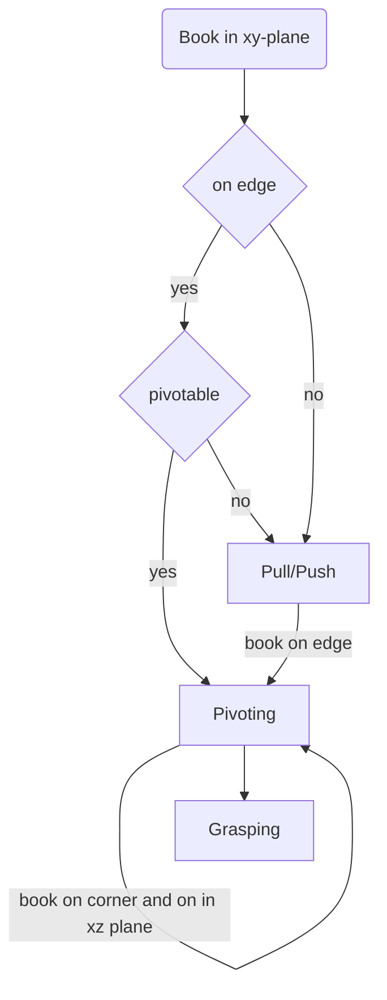

# Premanipulations 

The shelf lips present a significant challenge when handling books on the Amazon shelf, even in the simplest case of a single book. This raises the question of whether to ignore the shelf lip in the simulation and, if necessary, pad the shelves with styrofoam or a similar material to mimic a lip-free shelf. Alternatively, one could opt for a pivot-based approach, which may struggle more in cluttered scenes but may generate more interesting motions in the single-book-case.

## One book without shelf lip

In the case of one book without the lips a feasible grasp position can be achieved by pulling or pushing in most of the time.

## Two books without shelf lip

TODO

## Three or more books without shelf lip

TODO

## One book with shelf lip

If we want to grasp with simulated or real shelf lips, the premanipulations, even int the one-book-case become non-trivial. As we cannot pull or push to a graspable position if the book lies in the xy-plane, we would rely neccessary on pivoting. The goal is to pivot the book onto the yz plane, to then grasp it (either trough the soft side walls, hard to model though as gripper has to collide with side wall and go slide along it) or through the angle created by the pivoting between book and yz 

